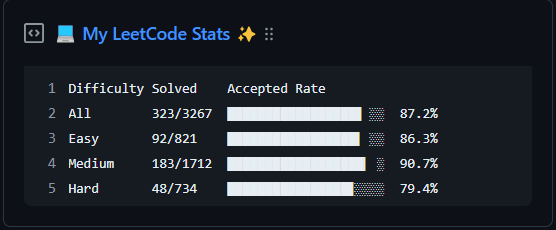

  
  <h1 align="center">Leetcode-Gist</h1>

## Objective

Update a pinned gist to display your LeetCode statistics and showcase your coding skills. Keep your GitHub profile up-to-date with your latest LeetCode achievements and progress. Share your problem-solving journey with the developer community. Show off your dedication and commitment to mastering algorithms and data structures. Let your LeetCode stats speak for themselves and inspire others to join the coding challenge. Keep pushing your limits and strive for excellence in the world of competitive programming.

## Prep Work

1. Create a new public GitHub Gist (https://gist.github.com/)
2. Create a token with the `gist` scope and copy it. (https://github.com/settings/tokens/new)
3. Find the username from your LeetCode profile `https://leetcode.com/{username}`

## Project Setup

Follow these steps to set up the project:

1. Fork this repository: Click on the "Fork" button at the top right corner of this page to create a copy of the repository in your GitHub account.

2. Go to your fork's `Settings` > `Secrets` > `Add a new secret` for each environment secret:

  - **`GIST_ID`:** Obtain the 32-bit ID from your gist URL. It can be found in the URL of your gist page, which looks like this: `https://gist.github.com/{github_username}/`**`762ebda9730630395aabdee06ce58fd1`**. Copy the ID and add it as a secret with the name `GIST_ID`.

  - **`GH_TOKEN`:** Generate a GitHub token with the necessary permissions. To do this, go to your GitHub account settings and navigate to the "Developer settings" section. From there, click on "Personal access tokens" and generate a new token. Make sure to grant the token the necessary permissions. Copy the token and add it as a secret with the name `GH_TOKEN`.

  - **`LEETCODE_USERNAME`:** Enter your LeetCode username. This is the username associated with your LeetCode profile.

3. Once you have added all the secrets, you are ready to use the project.
> :exclamation: **Important:** Remember to keep your secrets confidential and do not share them with anyone.

